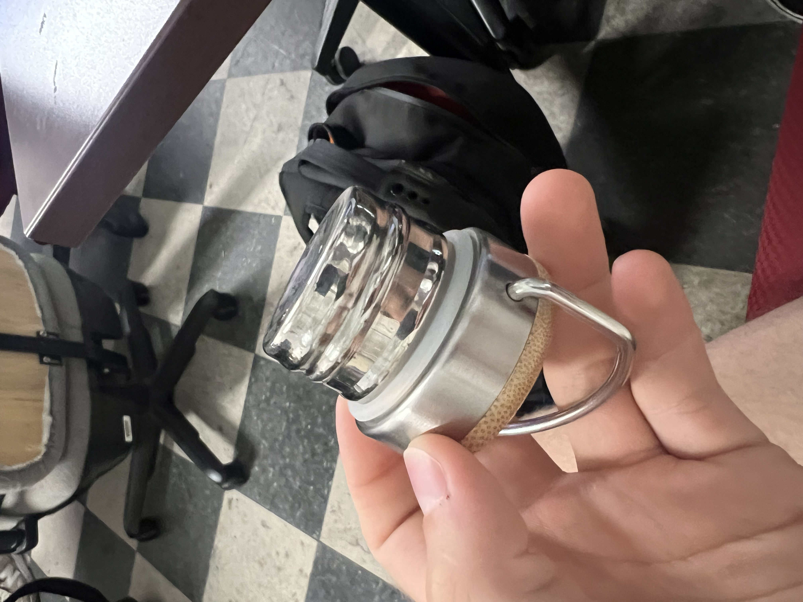
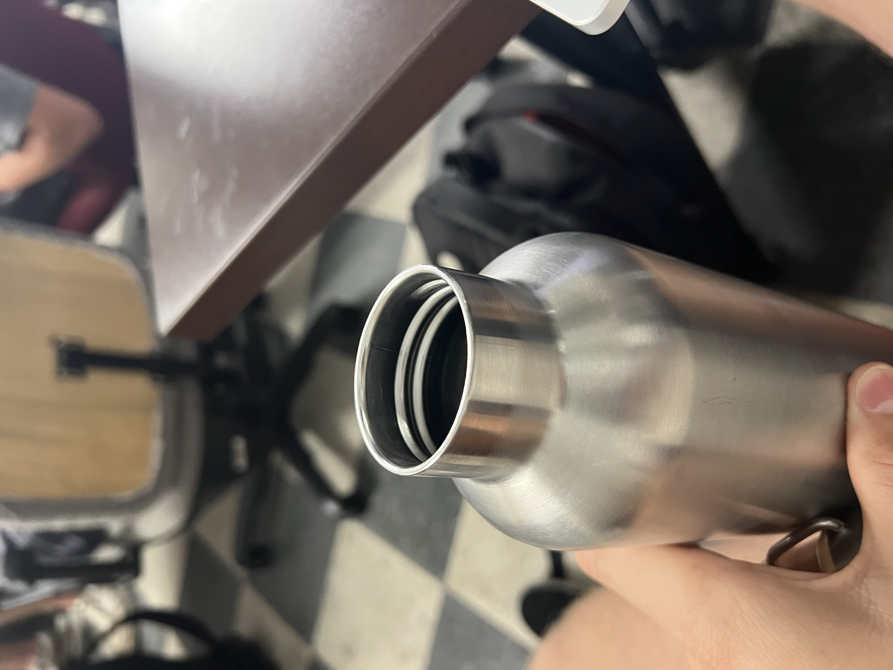

# A1 – [Topic]

## Objective

## Analyze

### Task A 

Portfolio 1: https://thanhvtran.com/

a. Navigability: The reader of this site can locate any project or Thanh's resume within 60 seconds. Navigation is not an downfall of this site.

b. Reproducibility: The documentation for each product does not contain enough documentation for a colleague to reproduce the work. The details provided are vague and give overarching principles instead of specific detail.

c. Evidence of reasoning: The portfolio only shows the process of designing, but not why each design was changed or implemented.

d. Professional tone: The language is professional in some areas, but many areas feel casual and not as technical as they should be. This is especially exaggerated when reading the technical projects that Thanh has completed.

Portfolio 2: https://tylerwisniewski.github.io/zt/

a. Navigability: This site is easily navigated by the reader, although one issue is the lack of text to label each project. The projects only have a thumbnail image, which is not enough for the reader to recognize what the exact project consisted of.

b. Reproducibility: The documentation for each product has a wonderful depth that would allow a reader to complete the projects on their own without issue.

c. Evidence of reasoning: The portfolio gives great detail about how each component was selected and why each part was designed the way it was.

d. Professional tone: The language is professional in all areas of the website.

### Task B

a. The primary function of my object is to contain water without leaking, and to insulate it so that it maintains its initial temperature.

b. The physical principle that governs its operation is the simple machine of a screw. The model is that the incline plane around a round object allows for it to be tightened and fasten things. The variables are the properties of the threads (fine or course, deeper or shallow), and the force applied to the head of the screw to tighten it. One assumption this model makes is that the material the screw is penetrating will have enough strength to hold the necessary force to tighten the screw. This assumption is valid because the metal threads of the water bottle were designed to be strong enough to allow the lid to screw into the body and clamp down hard enough to avoid leaking.

c. 

d. This design is so simple and universal that there are no patents listed for similar designs.

## Decide

## Communicate

