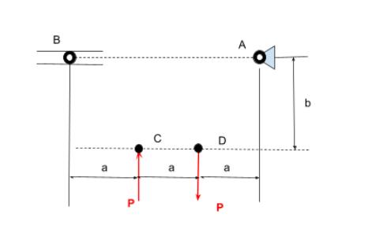
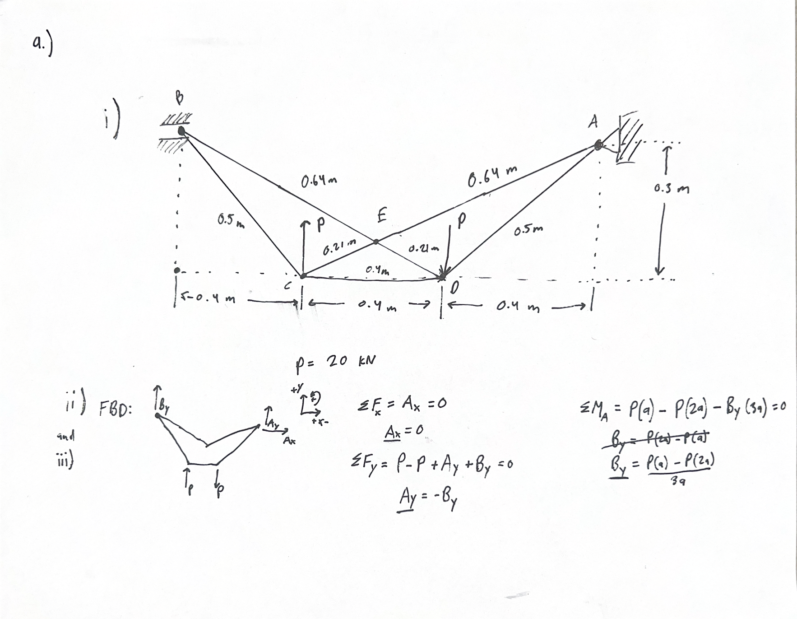
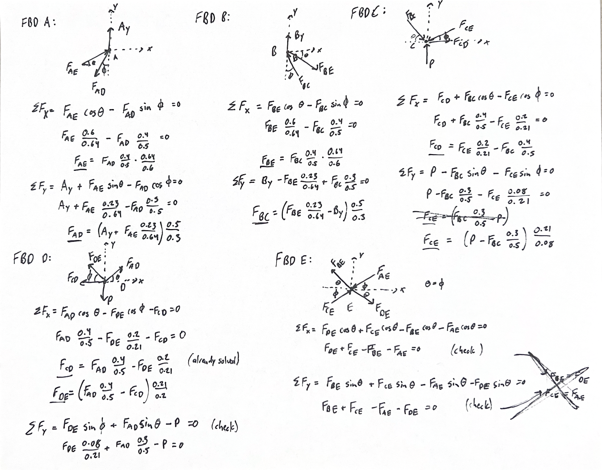
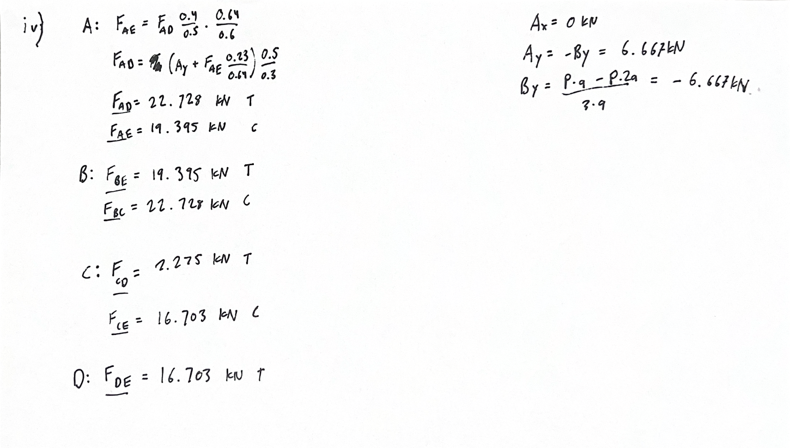
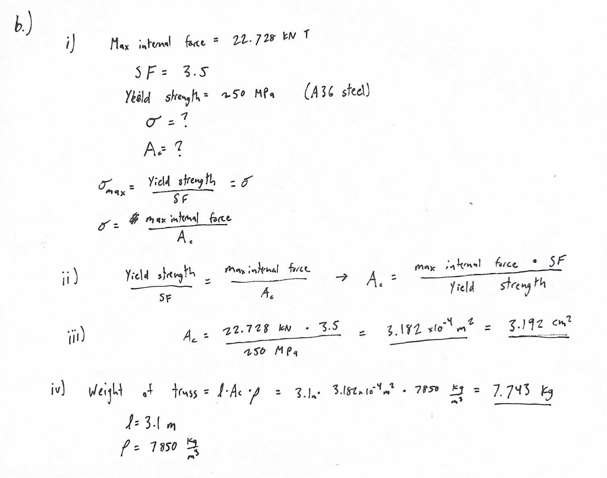
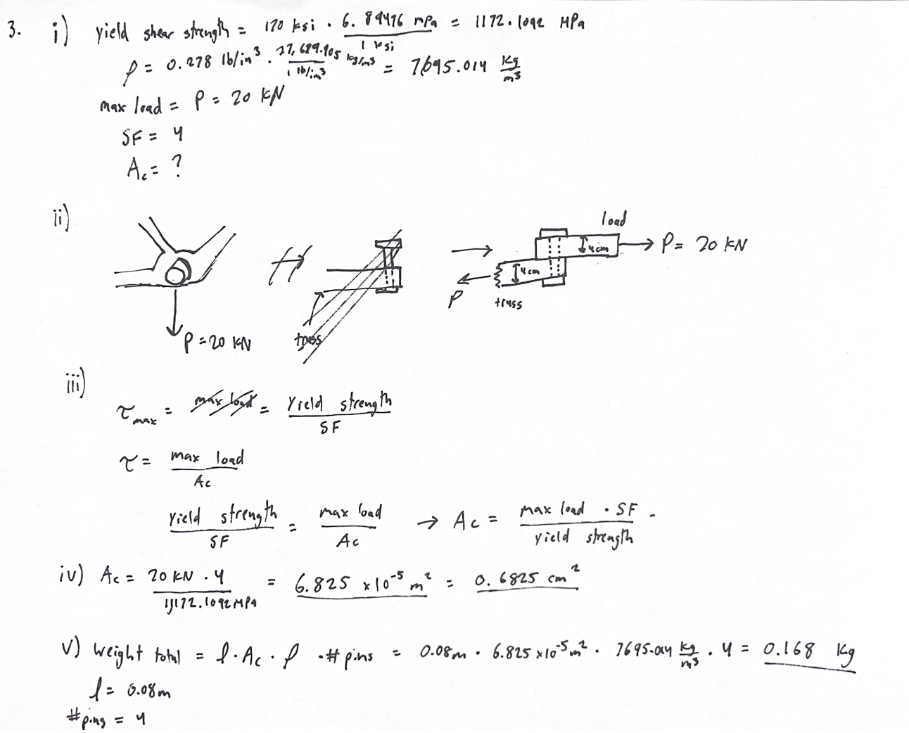
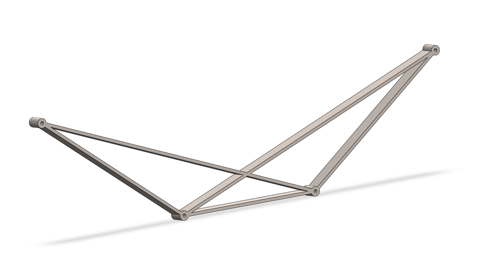
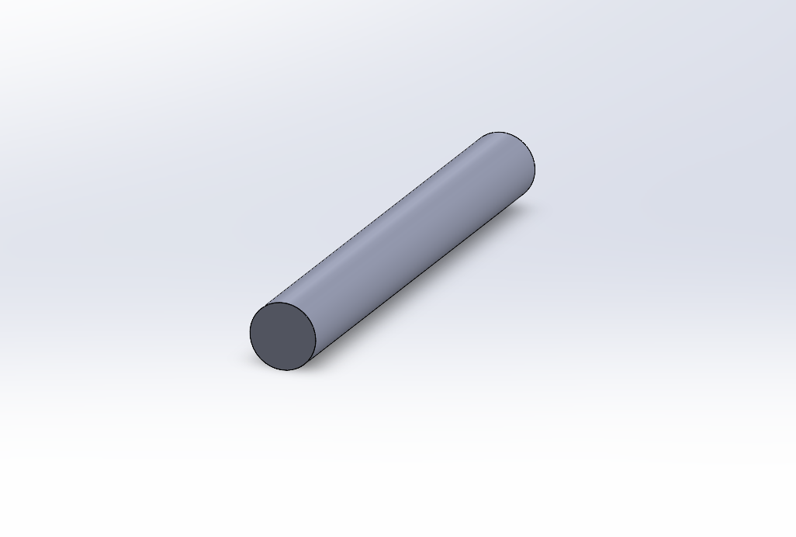

# A2 – Truss Stress Analysis

## Objective

The objective for this assignment is to design a a lightweight truss that would support two separate forces of the same magnitude but in varying directions. The designated attachment points and force locations and directions are given, but no preliminary truss designs are given. The image below is the layout of these attachment points, and the variables are given set values within the body of the assignment

## Analyze

From this description of the assignment objective, I then analyzed the requirements and restrictions given that would change the approach of my design. The biggest of these was the requirement to have a uniform cross-sectional area for each beam, this meant that I could not cater beam thicknesses to the stresses applied to them. Another large restriction was the given safety factor. This factor increased weight drastically compared to a lower value because it requires the cross-sectional area to be much larger.

## Decide

After this analysis, I then started on my design. After brainstorming for some time, I decided that having a symmetrical design would be best suited to this challenge. This would allow for the stresses within the beams to have the most similar magnitudes. From this point I created a design that would allow for the main beams connecting at each force, P, to carry the loads as close to symmetrically as possible. This design is shown below.

I chose to prioritize equal loading of the beams because this allows for the lightest weight design. The large safety factor and uniform cross-sectional area restrictions would not cause the beams to be overbuilt if all of the beams have the same forces through them.

From this point I then continued onto using the geometry from the design to analyze the forces through each beam as shown below (a few equations are also on the image above).

The maximum force through the beams was 22.73 kN of force. This force is not much higher than the applied force of 20kn at P. From here I was able to determine the required cross-sectional area of the beams, as well as the weight of the truss based on the geometry of the truss as well as the material properties of the A36 steel I used (A500 was not available in CAD software of choice). These calculations are depicted below.

After these calculations I then moved onto the pins which were required to be made of tool steel with designated properties. Using these properties along with the forces I found at each connection point, I found the minimum cross-sectional area with the safety factor that was given, as well as the total weight of all four pins combined. These final calculations are shown in the image below.

These decisions led me to modelling the following truss and pins as my final design in Solidworks. I did this using global variables so that the size of each component could be changed easily if needed. The images below show both designs once completed. The truss CAD file can be downloaded [here](https://drive.google.com/file/d/1wJ27q34oLm1ofn0M7SDJjOxS56n2aYaU/view?usp=sharing), and the pin CAD file can be downloaded [here](https://drive.google.com/file/d/1J8cG6q1LV1tzHJmihBDEIcMg-gMSjkL5/view?usp=drive_link). The design and calculations took 2 hours, the modeling took 1 hour, and recounting the steps and formatting the assignment took about 4 hours.

## Communicate

