# A4 – Motor Mount

## Sketch

I first started by Researching some mounting solutions. The links below are the 3 designs I looked at:  
[3d printed mount](https://cults3d.com/en/3d-model/tool/nema-17-stepper-motor-halter)  
[Metal 6-holed mount](https://www.amazon.com/Rustark-Diameter-Mounting-Resistance-Reduction/dp/B07Z9ZB5NC/ref=sr_1_29?crid=1658Y9WEGFIPO&dib=eyJ2IjoiMSJ9.2CzLMmKkazXpv-bEwug1olzNb9MD7_lwWo9jfDEA1-ig9pPgw3nsbYtac3OpCL-c83cwKSUxVnWFFKzYbNOdI3c-fjjnLNVGj53GnrGr_h8o6IpJITZMx8wYBW-Q7lTkhBVpDFDlhsuswNcYoEmJEg.yTJJNkcdEgwjrmSF8Dn51_MO4XxO1-I1tkbeZXvOBg0&dib_tag=se&keywords=plastic+stepper+motor+mount&qid=1789435462&s=industrial&sprefix=plastic+stepper+motor+moun%2Cindustrial%2C161&sr=1-29&xpid=EP21djhDugfFJ)  
[Metal 4-holed and slotted mount](https://www.amazon.com/Stepper-Motor-Mounting-Bracket-Screws/dp/B073V77VLD/ref=asc_df_B073V77VLD?tag=bngsmtphsnus-20&linkCode=df0&hvadid=80883033958798&hvnetw=s&hvqmt=e&hvbmt=be&hvdev=c&hvlocint=&hvlocphy=81612&hvtargid=pla-4584482511274409&psc=1)  

Then I started sketching my design and an isometric view for this. This allowed me to define one critical length not specified in the other views shown later.

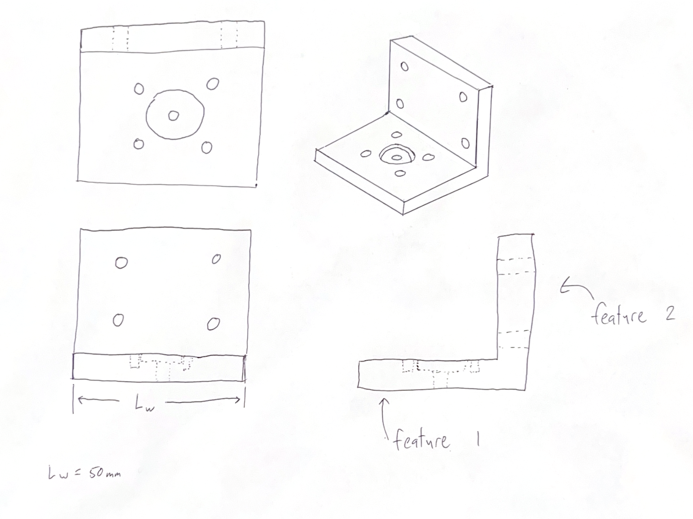

This then allowed me to create Free Body diagrams for both feature 1 and 2 while also creating a load case based on the torque the motor can output and a common pulley size that could be attached to the motor.

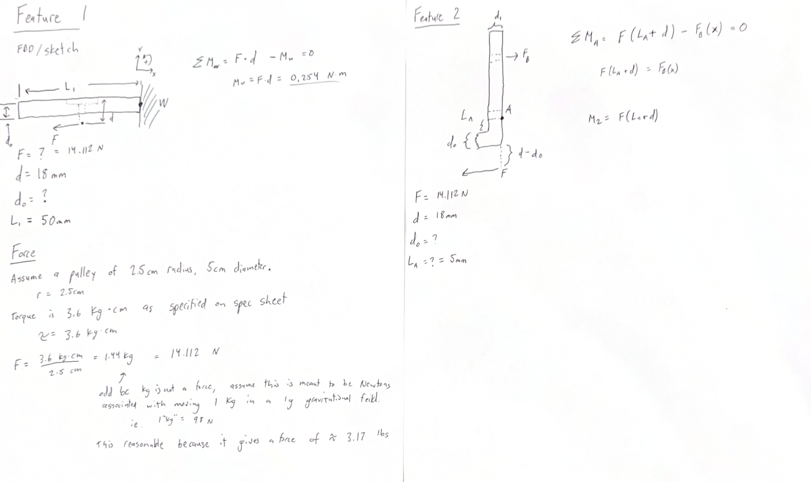

## Yield Stress Design: Features 1 & 2 

I started this process by first drawing a Free Body Diagram. This shows the assumptions used in this calculation and the way forces were applied. I then listed all the known and unknown variables from here and then applied the max bending stress equations as specified. After rearranging these values and plugging these values in, it would give me the thickness required for both features. Feature 1 required a thickness of 1.38mm and feature 2 required a thickness of 1.56mm. The image below shows my hand calculations for both features

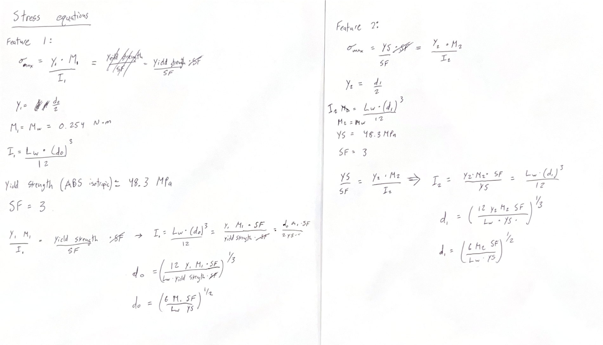

## Max Displacement Design: Features 1 & 2

I started this process by changing the main equation from the max stress equation to the max displacement equation. After doing this, it was easy to rearrange the equation to solve for thickness of feature 1. I did not recalculate for feature 2 because of it's short length. The short ~7mm length that would deform would be so short that the displacement added to the total displacement would be negligible compared to the displacement of the 50mm long feature 1. When calculating this way, the thickness of feature 1 was equal to 6.88mm. This process is shown below.

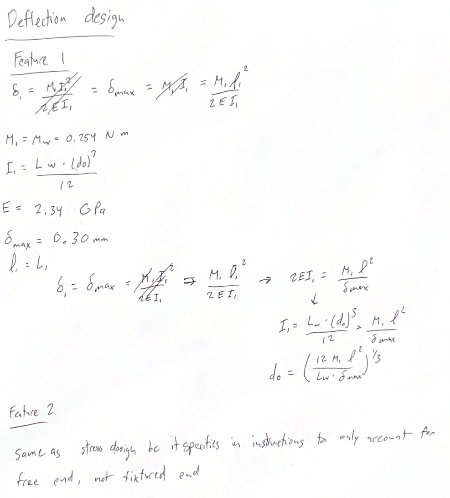

## CAD Model (Parametric)

From these hand calculations, I then plugged these determined values and equations into the equations menu of Solidworks. 

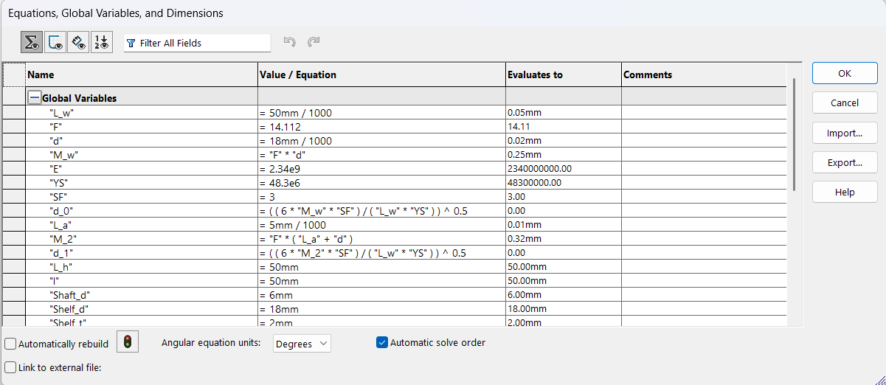

After this, I had all the necessary values to start creating these features in CAD along with the associated mounting geometries. Multiple steps of this process are shown below:

First, creating the base sketch and extruding it.

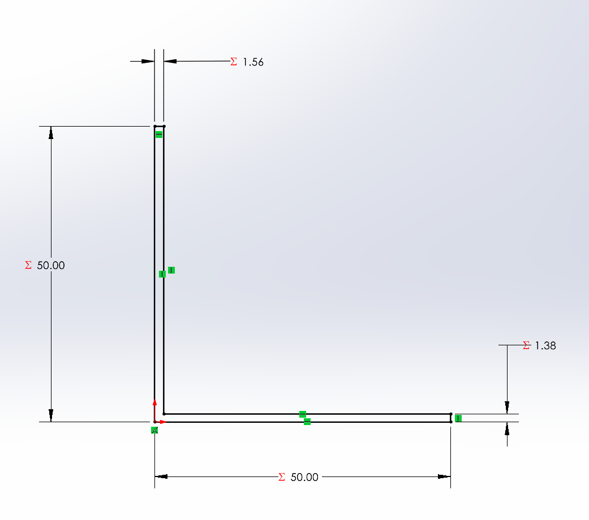
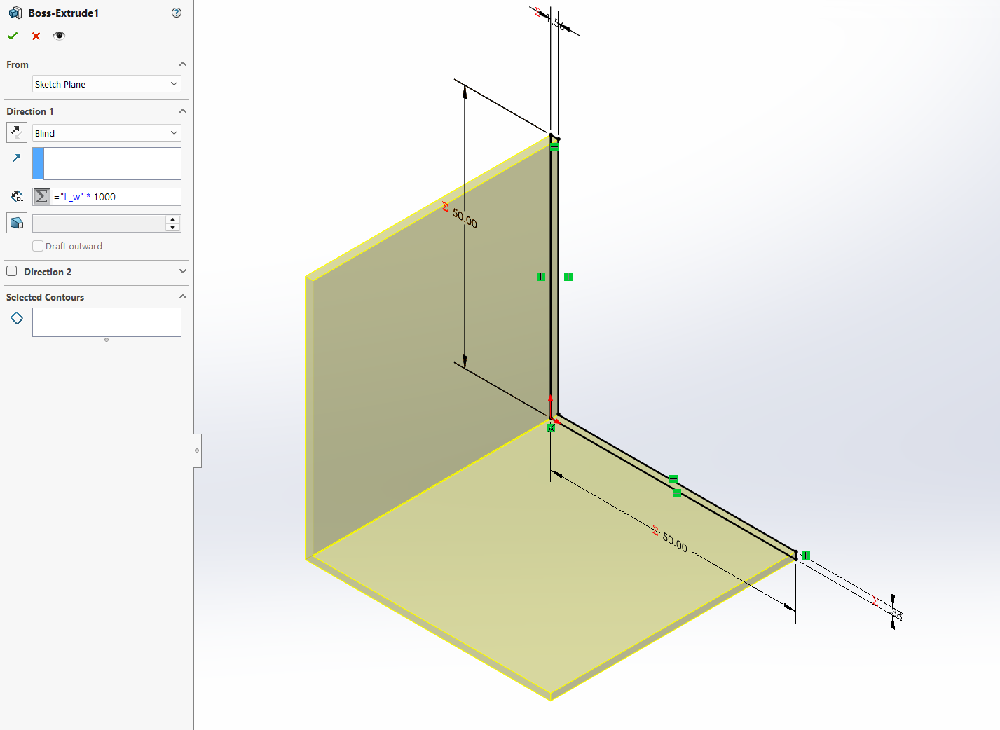

From there I was able to create the clearance holes in Feature 2 using a sketch of points and the "Hole Wizard" feature of Solidworks to make clearance holes for M5 mounting hardware.

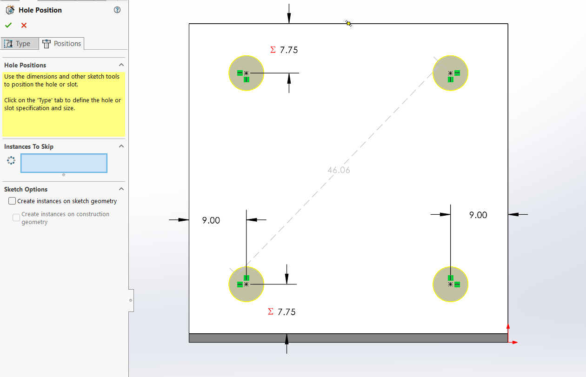

After this I created the reliefs for the motor's geometry to sit in as well as for the mounting screws to travel through. I used the Hole Wizard for the clearance holes for the M3 screws for mounting the motor, and I used basic extrusion cuts for the other geometries. All of these were based off of the variables in the equations menu (just as the geometries on feature 2 were).

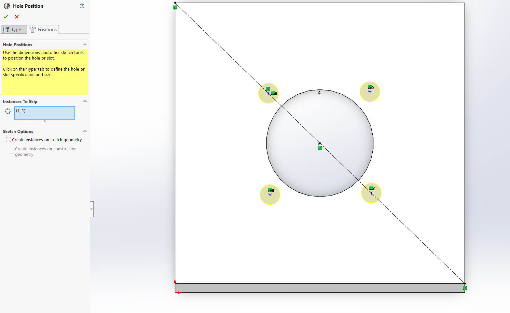

After doing this, the part was complete and I was able to continue to create a drawing for the motor mount.

## Drawing from CAD (MEGR 2157 section)

I started by using the "Drawing from Part" feature of Solidworks. This told the system which part to reference, but did not create any view or dimensions for me. From there, I selected the orthographic and isometric views within ASME specifications.

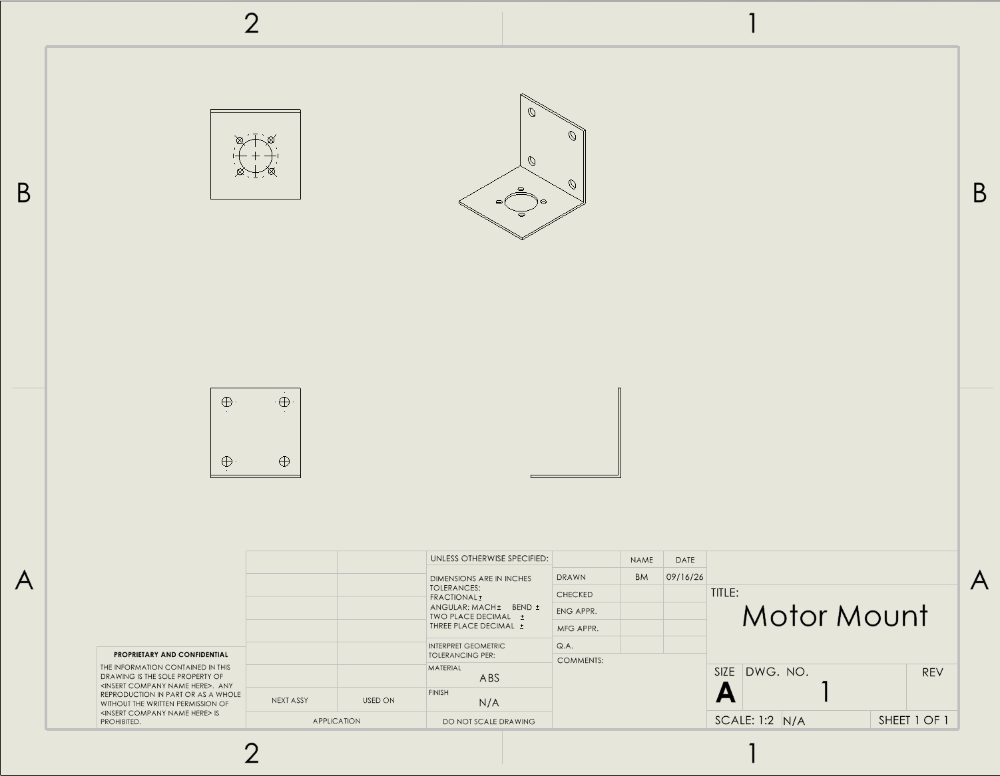

Then I added dimensions to the whole part making sure not to have duplicates and making sure to reference every dimension that is crucial to the part. This finished the drawing of my part.

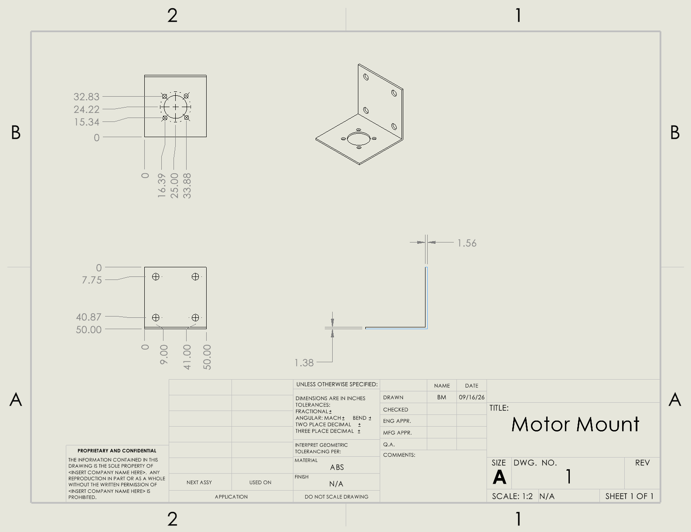

