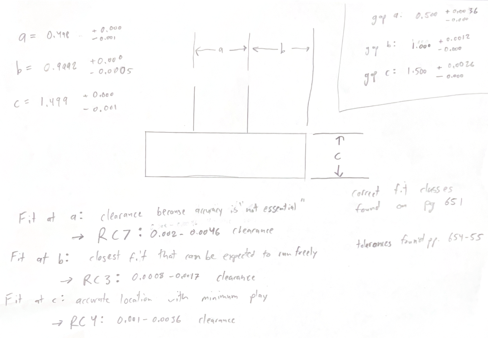
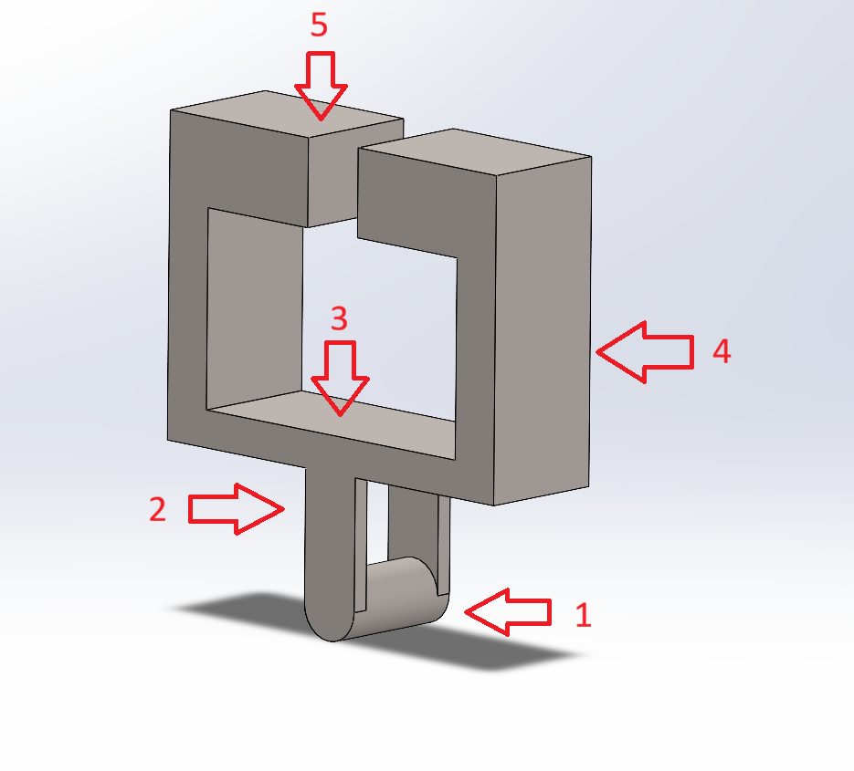
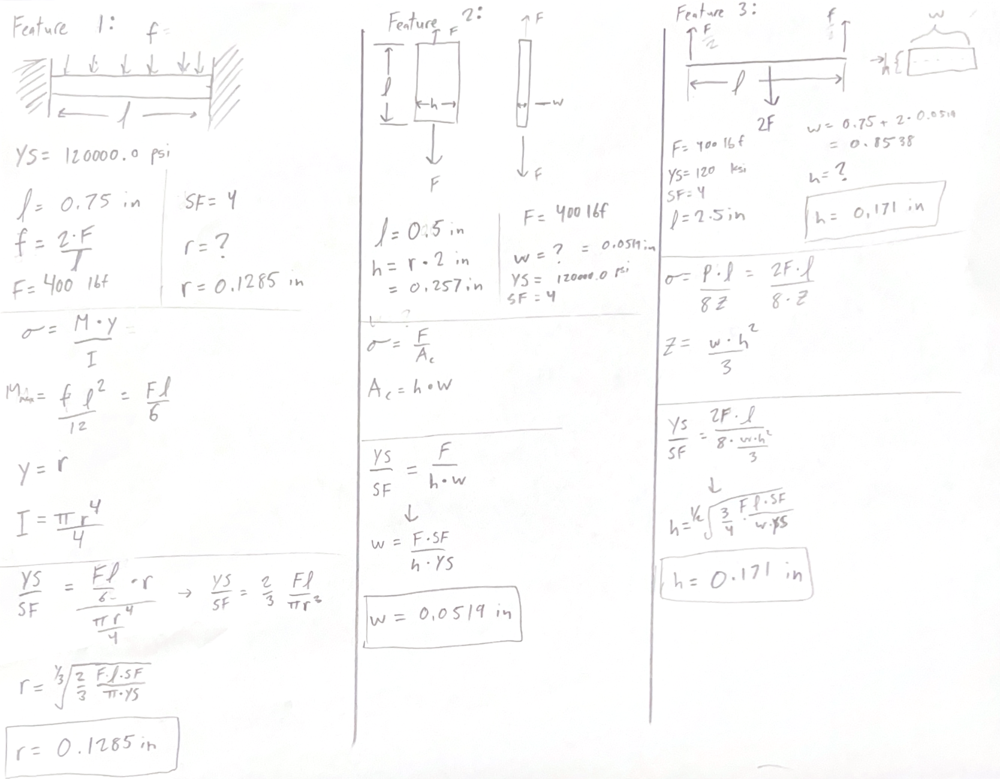
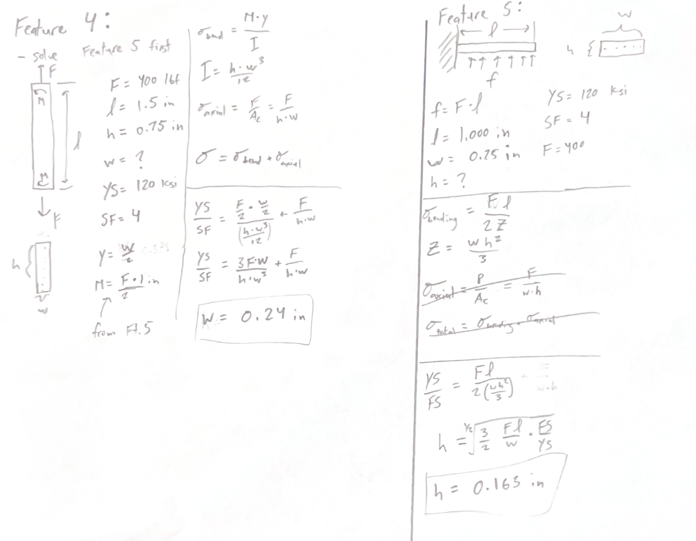
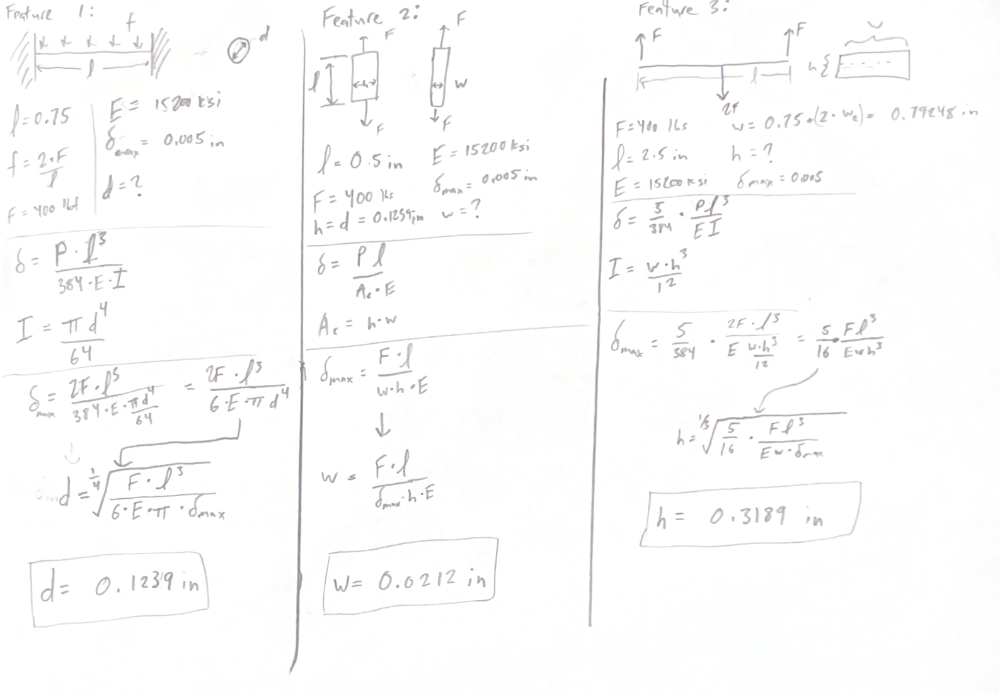
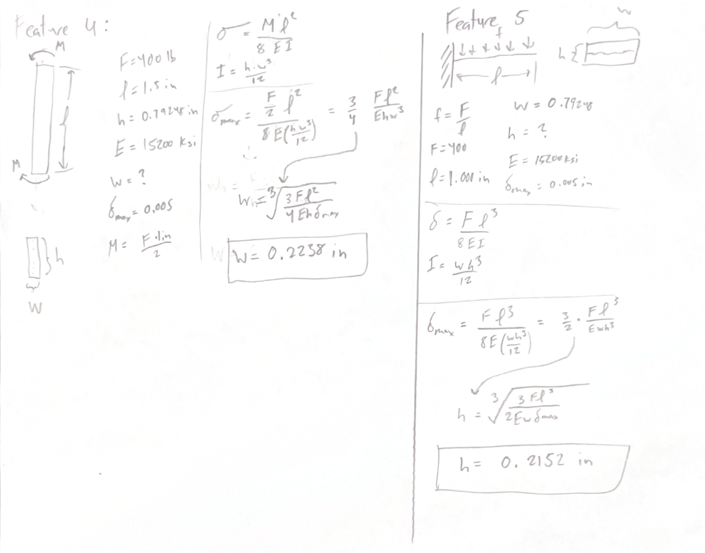
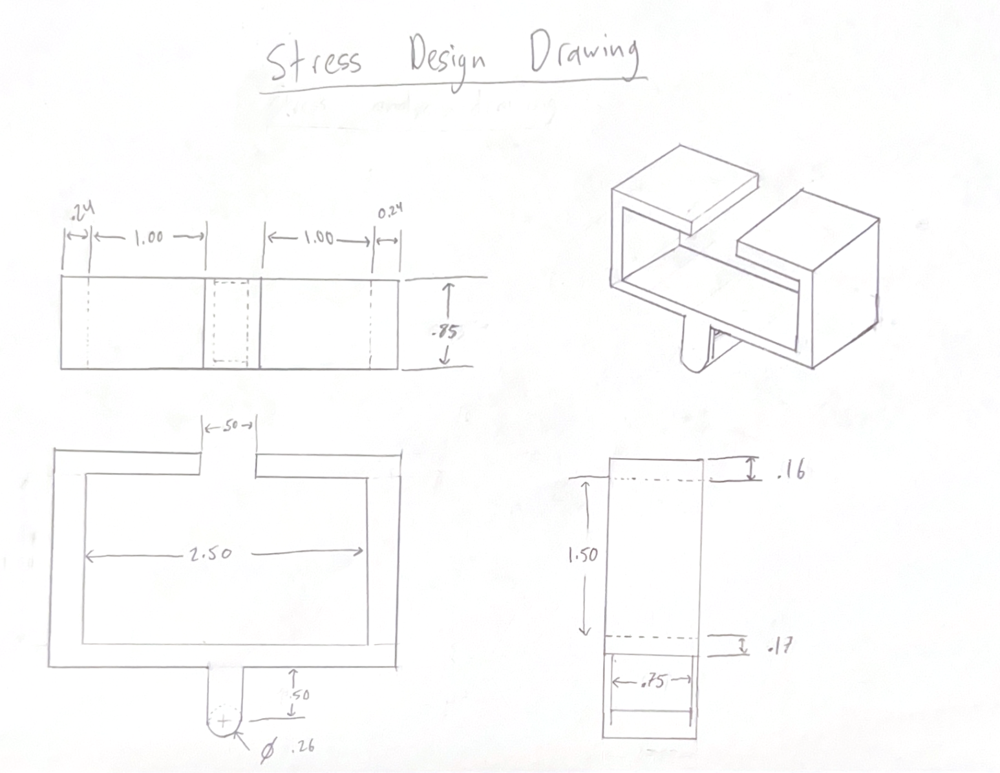
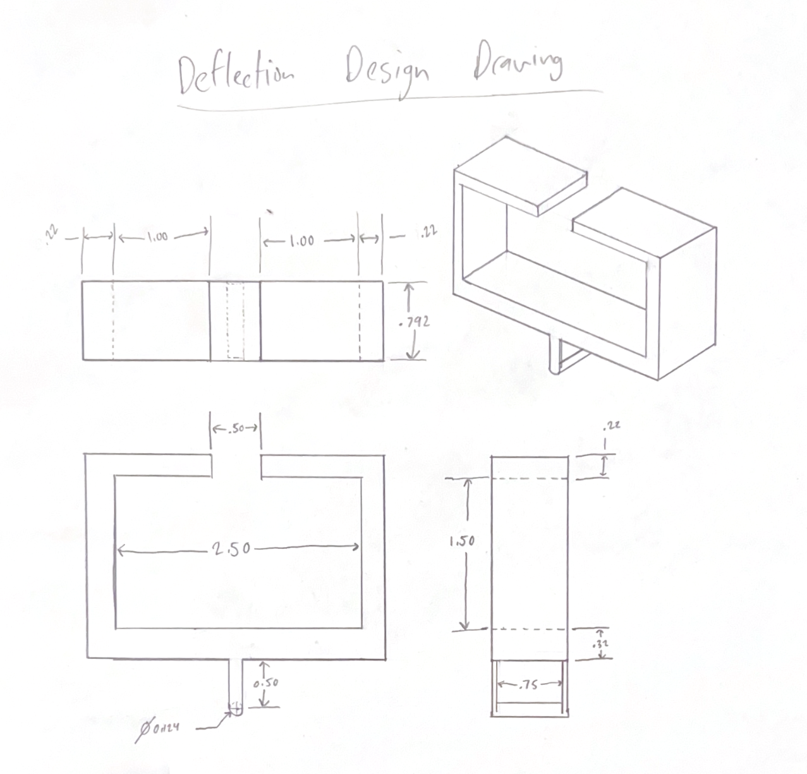
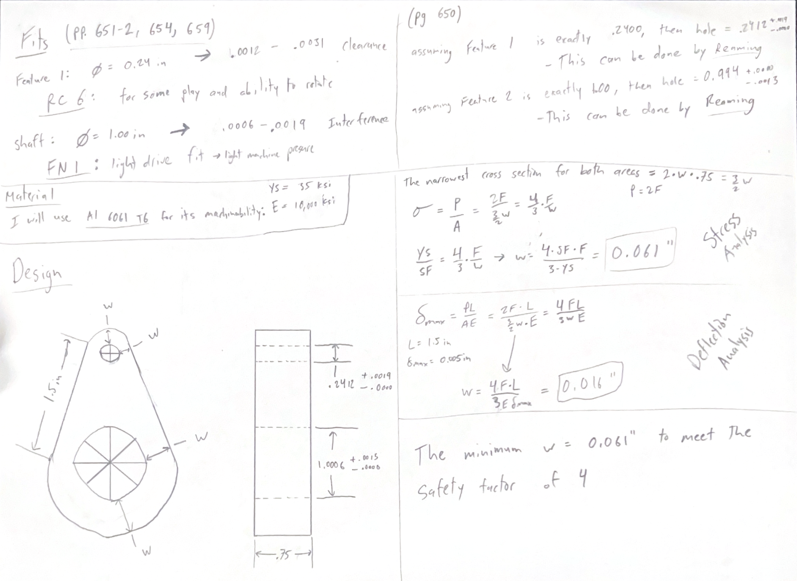
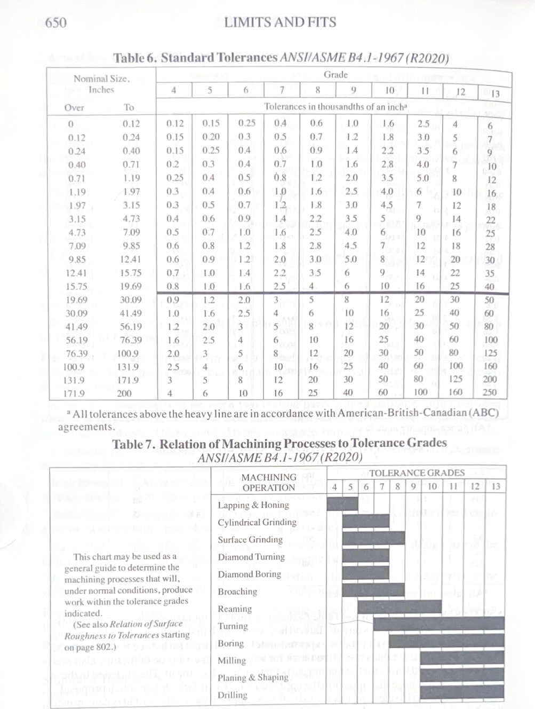

# A5 – Bracket Design  

## Fits and Tolerance Determination  

The first thing I did for designing this bracket was determining the tolerances needed for each slot of the bracket based on the dimensions and specifications given. The justification for each fit classification as well as the clearance required for that class of fit is shown in the image below. The final internal dimensions of the bracket were also determined in this stage of the design and are shown in the top-right of the image.  

  

## Feature Analysis Setup

I first chose the material to be the titanium alloy given (Ti-6Al-4V) in the requirements of this assignment. From this I was able to determine the material properties to use in all the feature calculations. I also determined my force applied to the bracket to be 800lbs. This force is effectively doubled because this force is the tension force in each side of the strap as shown in the diagram labeled "Figure 1" in the assignment page. From here, I created a mock-up of my design in SolidWorks as a way for me to keep track of the features and geometry of the bracket. Below is an image of this mock-up model with each feature labeled for future reference in my stress and deflection analysis  

  

## Feature Analysis — Stress

From this, I then started on determining each feature's dimensions based on stress calculations. Each feature required a different stress equation due to their differing geometries and beam layouts. I used the Machinery's Handbook (32nd edition) to obtain stress equations for all of these layouts and geometries. Each calculation required some level of assumption to be made to model it with simple equations—these assumptions can be seen through the feature diagram at the top of each feature's section. The hand calculations are shown in detail below.  

  
  

## Feature Analysis — Deflection  

I then repeated the feature analysis using deflection equations and a maximum allowed deflection to find the geometry of each feature. I used the Machinery's Handbook for this process as well. Each calculation required some level of assumption to be made to model it with simple equations—these assumptions can be seen through the feature diagram at the top of each feature's section. The calculations are below.  

  
  

## Drawings  

From this point, I created the drawings specified in the requirement for each design. My goal was to be as dimensionally accurate as possible. For this reason, I created these drawings at 1:1 scale with a straightedge to ensure a high level of accuracy. Both drawings are shown below.  

  
  

## Lessons Learned  

### Governing Failure Mode  
For Feature 1 and 2, the governing failure mode was stress by a large margin. I believe this was the case because of how short these parts were geometrically. To get Titanium to deflect .005" on a part only .750" is quite difficult unless the part is very thin. This was shown by the radius of feature 1 being halfed from the dimension determined by stresses compared to the dimension determined by deflection. It went from a radius of ~.120" to a radius of ~.065".  

### Error Propagation  
One instance where a error would get propagated to other features would be when determining the width of feature 2. This width drives the width of the entire bracket so if this width is too small or two large, it changes the other features with it.  

### Assumption Sensitivity  
One assumption was the assumption that Feature 2 was only under axial loads. If changing this assumption created a thicker or narrower width, then it would then affect the width of the total bracket.  

## MEGR 2157 Section  

All parts of this section were done on the paper below. I will annotate and add details in each section of captions underneath the image.  

  

### Dimensions  
I determined the dimensions based off of stress and deflection calculations using the forces this part would see along with the geometry of the part. I did the calculations on the right side of the paper using geometry gathered from the drawing on the left. The calculations showed that the stress analysis required a larger cross-section than the deflection analysis did, so the stress-calculated value is the final dimension of the part.  

### Proper Fits  
For both fits, I used the guide on pages 651-2 to determine which sliding/force fits to use for each shaft and hole. From there, I used the table on page 654 to determine the clearance for the hole for feature 1 and used the table on page 659 to determine the interference for the hole for the 1.000 in. bar.  
To determine the required manufacturing process, I referred to the charts below (located on page 650). I found that reaming would be sufficiently accurate for both holes based on these charts and the tolerances this part would need.  

  

