# A6 – Bracket Design CAD and Drawings

## Yield Strength Model

I started by plugging my hand calculations from last week's assignment into the equation menu of SolidWorks.
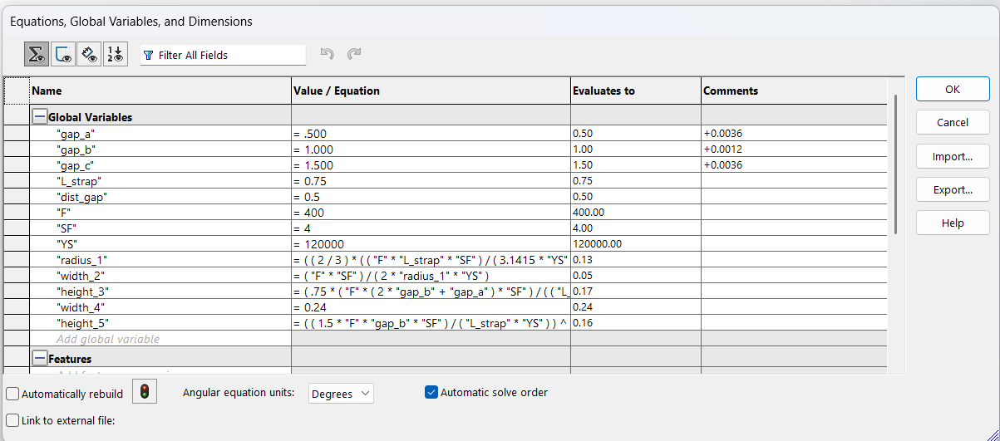  

From here, I then started modeling by creating a base sketch and extruding it to the correct dimensions.
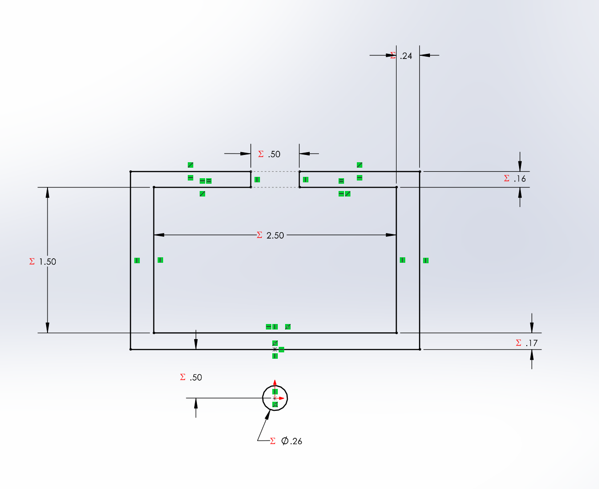  
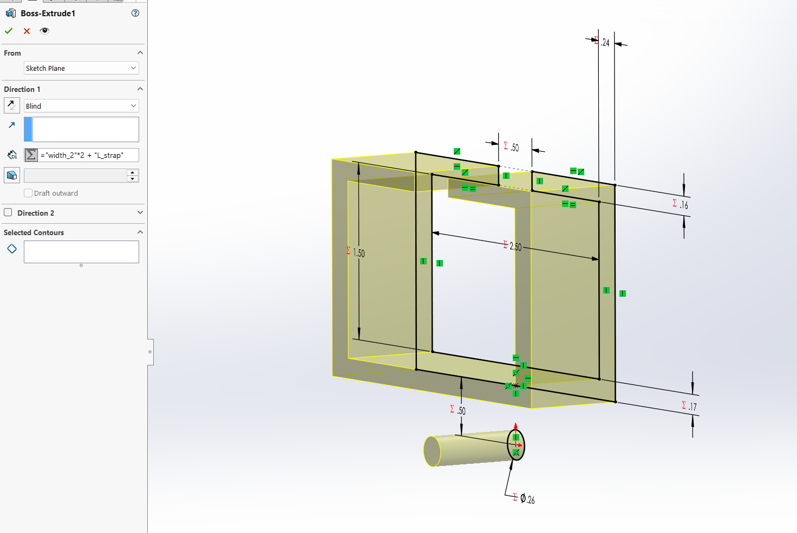  

Then I added a second sketch and extrusion to connect the cylinder to the main part.
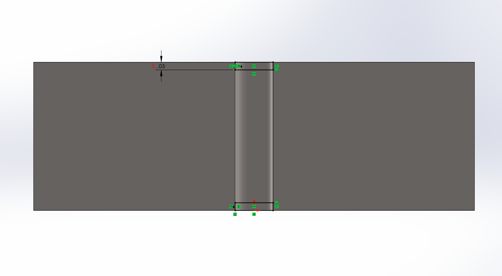  

This completed the stress-based bracket model.

## Yield Strength Drawing

After completing the model, I created the drawing. I started by creating the sheet format as shown below.  
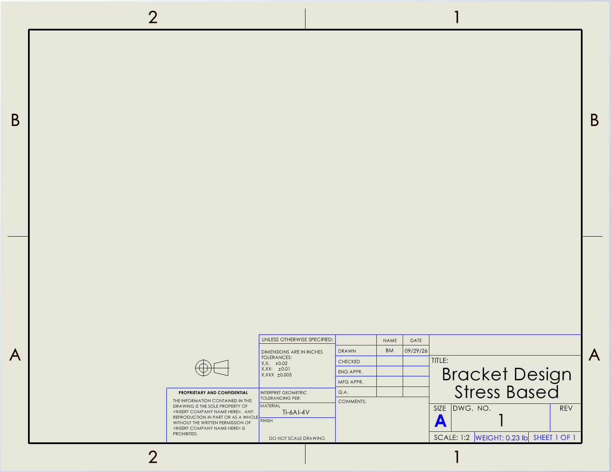  

Then I added views of the model and added dimensions to them. After this, the drawing was complete.  
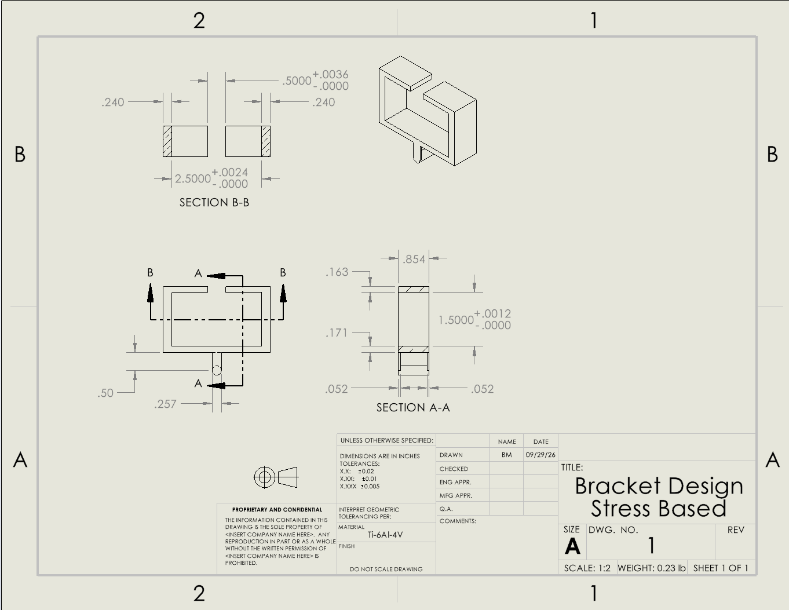  

## Deflection Model

I started by plugging my hand calculations from last week's assignment into the equation menu of SolidWorks.
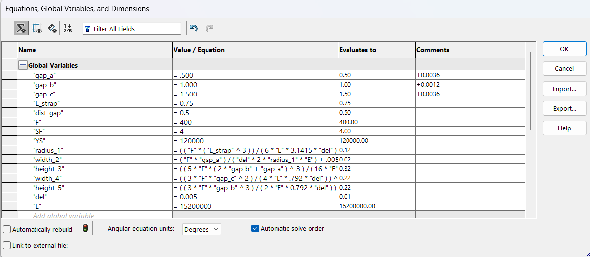  

From here, I then started modeling by creating a base sketch and extruding it to the correct dimensions.
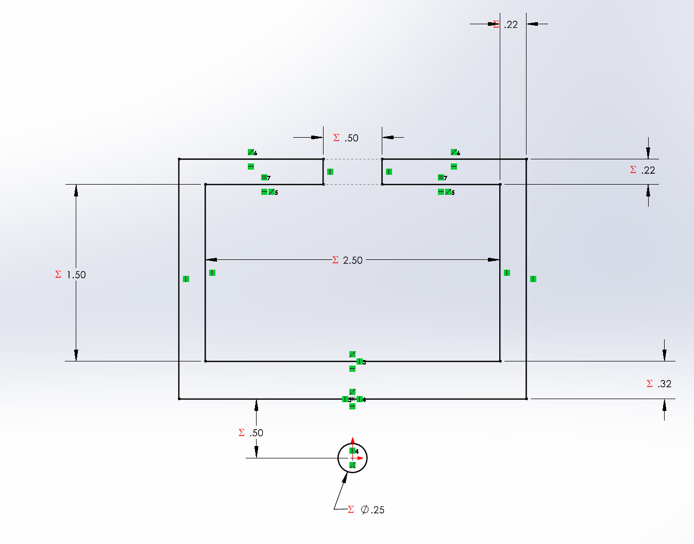  
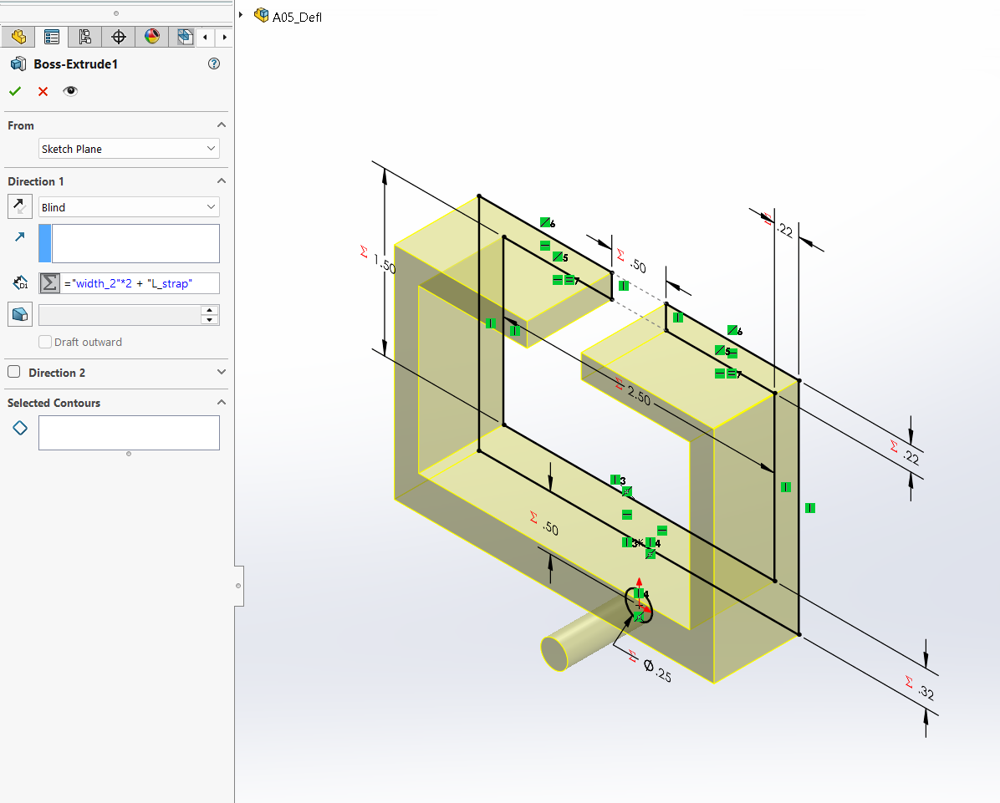  

Then I added a second sketch and extrusion to connect the cylinder to the main part.
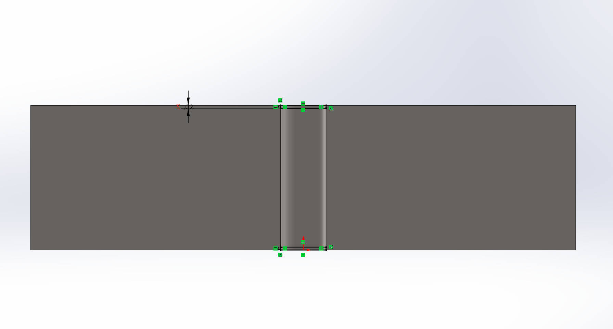  

This completed the deflection-based model.

## Deflection Drawing

After completing the model, I created the drawing. I started by creating the sheet format as shown below.  
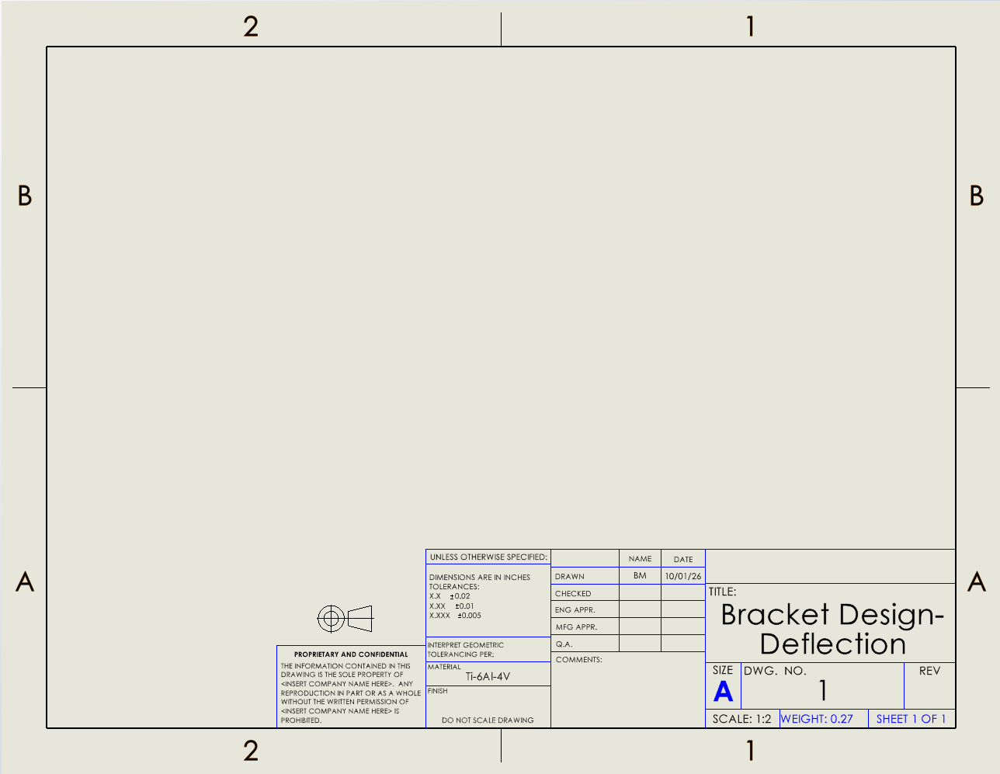  

Then I added views of the model and added dimensions to them. After this, the drawing was complete.  
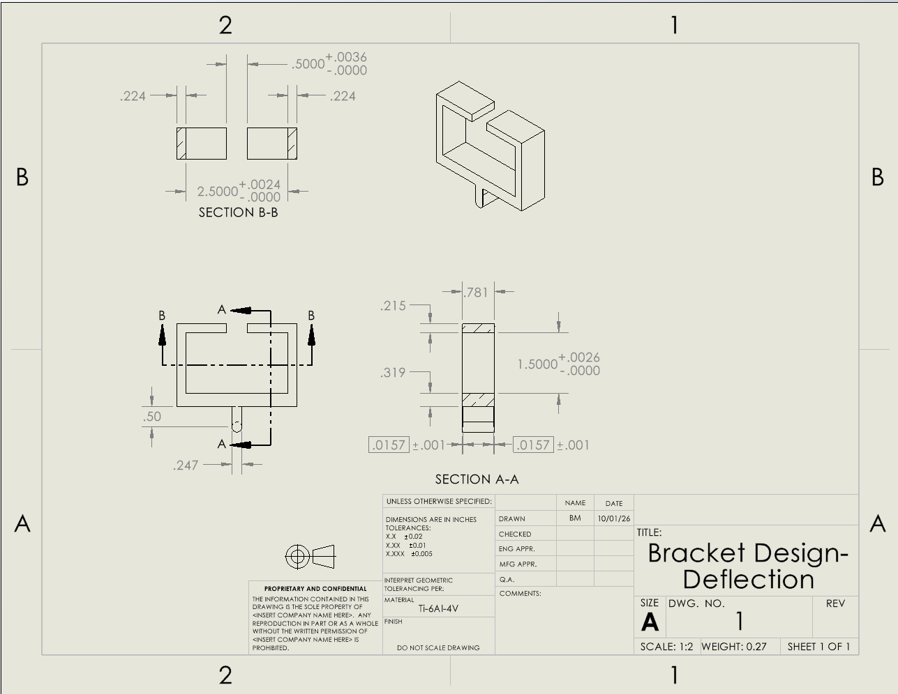  

##Reflections

Here is the link for the CAD and Drawing downloads: [Google Drive](https://drive.google.com/drive/folders/1GmS0BmtYg0Q14FtycEx9UUrLdUUzrm-P?usp=drive_link)  

I spent about 3.5 hours on this assignment. about 2.5 on the CAD and drawings and 1 hour on the write-up.

One equation used was the maximum Stress equation for a simple beam with unfixed ends and a distributed load. This equation is given in the Machinery's handbook on page 251. I represented this solving for the minimum height of the 3rd feature based on the maximum stress allowed and the width of feature 3. I used the following equation in the parametric menu:  

h = ( (3 * "F" * "L" * "SF") / (4 * "w" * "YS) ) ^ (1/2)

The tightest tolerance per length would be for the length of the bracket where it interacts with the "c" park of the T. This is a 1.5in long section with a tolerance of +0.0026in and -0.0000. I used this because this fit is specified as the tightest fit on the whole part and these are the tolerances required to achieve the desired sliding fit.

I used a looser tolerance for the distance the lower cylinder has to be from the body of the part (+- 0.020in). I did this because this is not crucial to how the bracket functions nor does it need to be precise for the strapping to fit over it.
